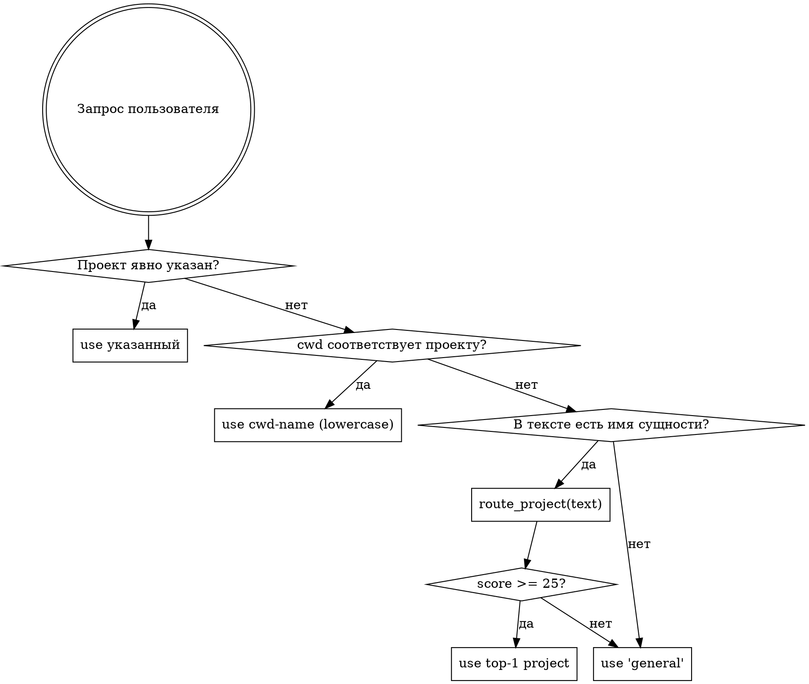
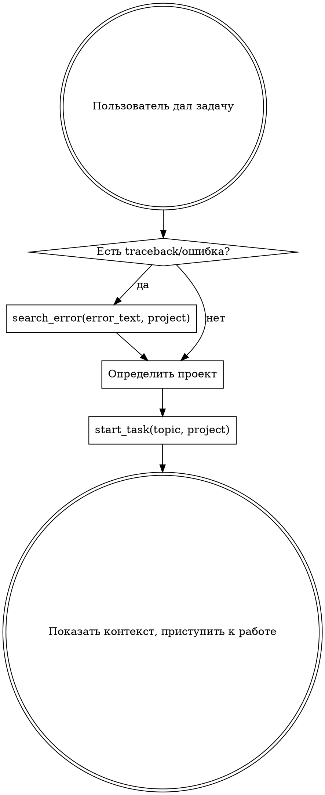
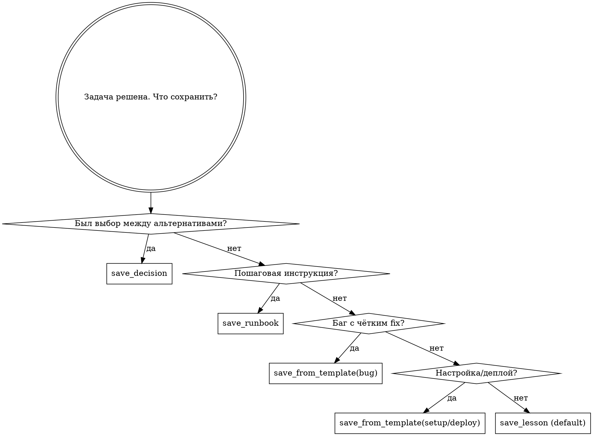

# Memory Autopilot

Автоматическое управление базой знаний. Ты НЕ спрашиваешь пользователя «сохранить ли в память?» — ты делаешь это сам. Пользователь не должен думать о памяти — это твоя работа.

## Железные правила

```
1. ПАМЯТЬ РАБОТАЕТ НЕВИДИМО. Пользователь ставит задачу — ты сам решаешь
   что искать, что сохранять, куда класть, какой tool использовать.

2. НИКОГДА НЕ ИСПОЛЬЗУЙ mcp__memory (create_entities, add_observations и т.д.).
   ТОЛЬКО memory-compiler tools (mcp__memory-compiler__*).

3. ИМЕНА ПРОЕКТОВ — В НИЖНЕМ РЕГИСТРЕ. Сервер сам нормализует, но единообразие
   в твоих вызовах помогает другим сессиям.

4. НЕ ХАРДКОДЬ имена клиентов / проектов — узнавай через `route_project()` или
   `list_projects()`. Это open-source-инструмент, утечки имён клиентов недопустимы.
```

## Определение проекта (без хардкода)

Скил работает с любой базой знаний без предварительной настройки. Алгоритм:



**Правила:**
1. Если пользователь явно сказал «в проект X» / упомянул имя проекта дословно — использовать.
2. **Передавай `cwd` в `route_project()`** — сервер сам сравнит с `list_projects()`. Если basename рабочего каталога = существующий проект → возвращает его score 100. Это самый частый случай.
3. Если `cwd` не помог — `route_project(text=сообщение_пользователя)` ранжирует по содержимому сообщения.
4. Если ни один не подошёл (score < 25) — `general` (потом пользователь может уточнить).

**Пример вызова:**
```
route_project(
  text="продолжим работу с REST API",  // что сказал пользователь
  cwd="/home/user/dev/myapp"           // твой рабочий каталог (Bash: pwd)
)
```

**НЕ держи список клиентов в скиле.** Все имена приходят из `list_projects()` и `route_project()` динамически.

## Фаза 0: Классификация входа

Прежде чем действовать — определи тип сообщения:

| Тип | Пример | Действие |
|-----|--------|----------|
| **Continuation (новая сессия)** | «продолжим», «давай дальше», «что у нас» | определи проект → `start_task(topic, project=...)` БЕЗ search; сервер v1.2+ распознает continuation и вернёт активный контекст + последнюю сессию |
| **Задача** | «настрой nginx», «проверь доступность X» | Фаза 1 (start_task) |
| **Проверка с упоминанием сущности** | «проверь X», «статус Y» | search(сущность) → подтянуть контекст → выполнить |
| **Факт/информация** | «сервер X на Y», «пароль от Z: …» | Сразу save_lesson/save_secret/save_tracking/edit_article |
| **Вопрос с контекстом** | «какой IP у X?», «как настроен Y?» | search/get_context/read_article |
| **Ошибка/traceback** | стектрейс, код ошибки | search_error → Фаза 1 |
| **Простой вопрос** | «что такое X?», «да», «нет» | НЕ триггерить |
| **Приветствие** | «привет» | НЕ триггерить |

### Правило continuation — критично

При фразах **«продолжим», «давай дальше», «что у нас по X»** в начале сессии:

1. **НЕ делай `search()` с фразой пользователя** — она состоит из стопвордов, вернёт мусор.
2. Определи проект (см. блок выше).
3. Вызови `start_task(topic="<фраза>", project="<проект>")`. Сервер v1.2+ распознает continuation автоматически и отдаст активный контекст + последнюю сессию проекта.
4. Если в выводе написано «*Запрос распознан как «продолжить работу»*» — всё работает.

## Фаза 1: Старт задачи



**start_task вернёт:** похожие кейсы, контекст сессии, активный контекст, решения, runbooks. Используй всё это.

## Фаза 2: В процессе работы

### Нужны креды, пароли, IP, пути

```
search(query="конкретные термины", project)
  → если нашёл зашифрованную статью → read_article(project, filename) — расшифрует автоматически
  → НЕ СПРАШИВАЙ пользователя. Секреты в базе.
```

### Правила поиска — ОБЯЗАТЕЛЬНО

1. **Кириллица vs латиница** — если на латинице и пусто, попробуй кириллицу и наоборот
2. **Контент секретов не индексируется** — search работает только по title/tags. Ищи по НАЗВАНИЮ сущности
3. **Если первый search пуст** — попробуй 2-3 варианта (имя клиента, продукт, тип ресурса)
4. **НЕ выдумывай tools** — есть только `search`, `search_by_tag`, `search_error`, `search_decisions`, `search_snippets`

### Нужен контекст

```
get_context(project, query="как настроен X")
```

### Документация с URL

```
ingest(project, url="https://docs.example.com/api")
```

### Новая ошибка

```
search_error(error_text="полный текст", project)
```

### Текущий статус (версия, деплой, конфиг)

```
get_current(project, entity="release"|"deployment"|"config")
```

## Фаза 3: Сохранение результатов

### Обновление vs создание

Перед save_lesson проверь: статья уже существует?

```
search(query="тема которую сохраняешь", project)
  → если score > 35 на похожую тему: edit_article(project, filename, content, append=true)
  → иначе: save_lesson / save_decision / save_runbook
```

### Дерево выбора tool



### Дополнительные сохранения

| Ситуация | Действие |
|----------|----------|
| Новый пароль/ключ/cred | `save_secret(topic, content, project)` |
| Изменилась версия/конфиг/статус | `save_tracking(project, entity, facts)` |
| Обновить существующую статью | `edit_article(project, filename, content, append=true)` |
| URL с документацией | `ingest(project, url)` |

## Фаза 4: Завершение

```
finish_task(
    topic = "краткое название задачи",
    content = "проблема + причина + решение + ключевые факты",
    project = определённый проект,
    session_summary = "что сделано в сессии",
    open_questions = "что осталось" (если есть)
)
```

**finish_task вызывается ВСЕГДА когда задача решена.** Не жди просьбы пользователя.

## Фоновые действия (молча)

- **start_task / search / search_error** — вызывай в начале, покажи только релевантные находки
- **finish_task / save_*** — вызывай в конце, коротко подтверди «Записано»
- **route_project / list_projects** — делай сам если непонятно куда сохранять

## Что НЕ сохранять

- Тривиальные ответы на общие вопросы («что такое X?»)
- Информацию которая уже в коде / git history
- Временный контекст текущей сессии (для этого session_summary в finish_task)

## Red Flags

| Мысль | Реальность |
|-------|------------|
| «Спрошу пользователя какой проект» | Используй route_project(text) |
| «Это не стоит сохранять» | Если решал >2 минут — сохрани |
| «Сохраню потом» | Сохрани сейчас. Потом = никогда |
| «Пользователь не просил сохранить» | Он не должен просить. Это автопилот |
| «Не знаю какой tool выбрать» | Дерево выбора выше |
| «Забыл вызвать start_task» | Вызови сейчас, даже в середине работы |
| «Задача простая для finish_task» | Если использовал save_* — вызови finish_task |
| «Захардкожу клиента в скил» | НЕТ. Это утечка. Используй route_project |
