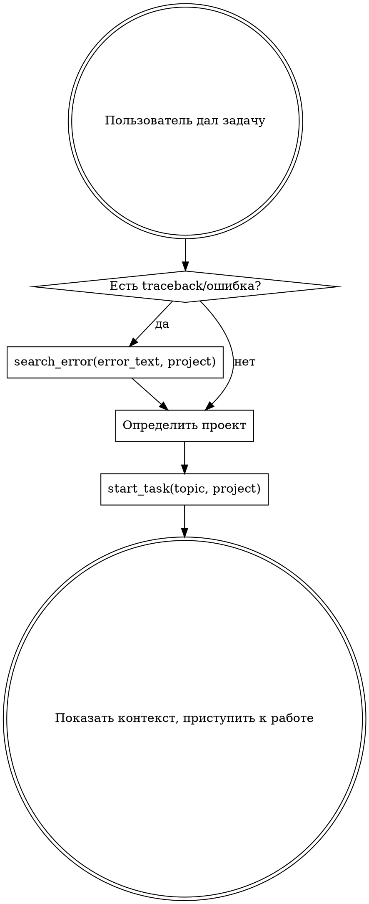
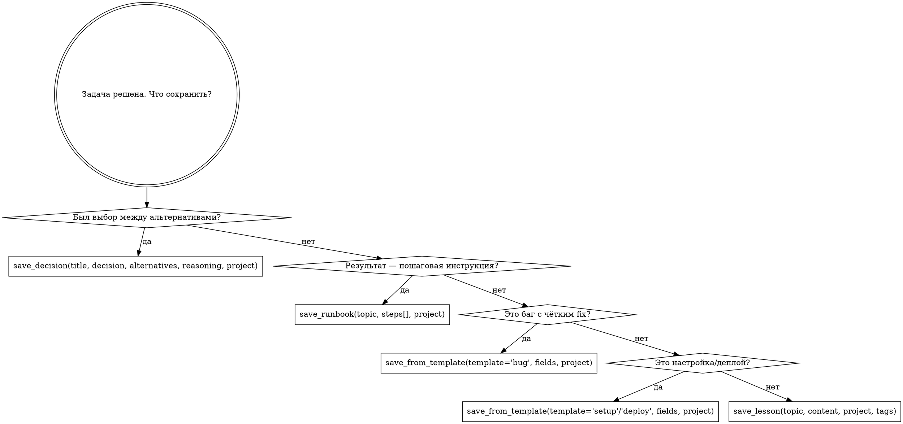

# Memory Autopilot

Автоматическое управление базой знаний. Ты НЕ спрашиваешь пользователя "сохранить ли в память?" — ты делаешь это сам. Пользователь не должен думать о памяти — это твоя работа.

## Железное правило

```
1. ПАМЯТЬ РАБОТАЕТ НЕВИДИМО. Пользователь ставит задачу — ты сам решаешь
   что искать, что сохранять, куда класть, какой tool использовать.

2. НИКОГДА НЕ ИСПОЛЬЗУЙ mcp__memory (create_entities, add_observations и т.д.).
   ТОЛЬКО memory-compiler tools (mcp__memory-compiler__*).
   mcp__memory — это устаревшая система, данные в ней не структурированы и не зашифрованы.
```

## Определение проекта

| Ключевые слова / контекст | Проект |
|---------------------------|--------|
| Серверы, сеть, DNS, SSL, NAS, VPN, Mikrotik, nginx | `infra` |
| memory-compiler, MCP-сервер базы знаний, этот проект | `memory-compiler` |
| NiksDesk, тикеты, прайсы, портал, веб-приложение НИКС | `niksdesk` |
| Процессы, отчёты, методологии, ассистент | `work` |
| 1С общее, ERP, УТ, ЗУП, платформа | `1c` |
| МОТ, клиент МОТ | `mot_ut` |
| ХЗТИ, клиент ХЗТИ | `hzti_ut` |
| ДВЛОМ, клиент ДВЛОМ | `dvlom_buh` |
| Золотая Антилопа, Вахитов, УНФ | `antilopa_unf` |
| Личное, машина, дом, ОСАГО, игры | `personal` |
| cwd = memory-compiler | `memory-compiler` |
| Не удаётся определить | → вызови `search(query)` и возьми project из результата |

## Фаза 0: Классификация входа

Прежде чем действовать — определи тип сообщения:

| Тип сообщения | Пример | Действие |
|---------------|--------|----------|
| **Задача** | "настрой nginx", "проверь доступность 1С Антилопа" | → Фаза 1 (start_task) |
| **Проверка с упоминанием сущности** | "проверь 1С Антилопа", "статус NiksDesk" | → search(сущность) → подтянуть контекст (IP, креды, конфиг) → выполнить |
| **Факт/информация** | "сервер X хостится на Y", "пароль от Z: ..." | → Сразу save_lesson/save_secret/save_tracking/edit_article |
| **Вопрос с контекстом** | "какой IP у сервера МОТ?", "как настроен nginx?" | → search/get_context/read_article |
| **Ошибка/traceback** | стектрейс, код ошибки | → search_error → Фаза 1 |
| **Простой вопрос** | "что такое nginx?", "да", "нет" | → НЕ триггерить |
| **Приветствие** | "привет", "здарова" | → НЕ триггерить |

## Фаза 1: Старт задачи



**start_task вернёт:** похожие кейсы, контекст сессии, активный контекст, решения, runbooks. Используй всё это в работе.

## Фаза 2: В процессе работы

### Нужны креды, пароли, IP, пути

```
search(query="пароль nginx mot" или "IP сервер 1С ХЗТИ", project)
  → если нашёл зашифрованную статью → read_article(project, filename) — расшифрует автоматически
  → НЕ СПРАШИВАЙ пользователя. Секреты в базе.
```

### Нужен контекст по другой теме

```
get_context(project, query="как настроен nginx для niksdesk")
```

### Нужна документация с URL

```
ingest(project, url="https://docs.example.com/api")
  → сервер сам скачает, конвертирует, предложит статью
```

### Встретил новую ошибку

```
search_error(error_text="полный текст ошибки или traceback", project)
  → если нашёл решение — применяй
  → если не нашёл — решай сам, потом сохрани (Фаза 3)
```

### Нужен текущий статус (версия, деплой, конфиг)

```
get_current(project, entity="release") или get_current(project, entity="deployment")
```

## Фаза 3: Сохранение результатов

### Обновление vs создание — ВАЖНО

Перед save_lesson ВСЕГДА проверяй: может статья уже существует?

```
search(query="тема которую хочешь сохранить", project)
  → если нашёл статью с очень похожей темой (score > 35):
    → edit_article(project, filename, content, append=true)  ← ДОПИСАТЬ, не дублировать
  → если не нашёл:
    → save_lesson / save_decision / save_runbook (создать новую)
```

Это предотвращает дубли. save_lesson тоже делает автомерж, но edit_article точнее когда знаешь конкретный файл.

### Дерево выбора tool



### Дополнительные сохранения (если применимо)

| Ситуация | Действие |
|----------|----------|
| Узнал новый пароль/ключ/cred | `save_secret(topic, content, project)` |
| Изменилась версия/конфиг/статус | `save_tracking(project, entity, facts)` |
| Нужно обновить существующую статью | `edit_article(project, filename, content, append=true)` |
| Получил URL с документацией | `ingest(project, url)` |

## Фаза 4: Завершение

```
finish_task(
    topic = "краткое название задачи",
    content = "проблема + причина + решение + ключевые факты",
    project = определённый проект,
    session_summary = "что сделано в сессии",
    open_questions = "что осталось" (если есть)
)
```

**finish_task вызывается ВСЕГДА когда задача решена.** Не жди просьбы пользователя.

## Фоновые действия (делай молча, не сообщай пользователю)

- **start_task / search / search_error** — вызывай молча в начале, покажи только релевантные находки
- **finish_task / save_*** — вызывай молча в конце, коротко подтверди "Записано в базу знаний"
- **Определение проекта** — делай сам по таблице выше, не спрашивай

## Что НЕ сохранять

- Тривиальные ответы на вопросы (что такое X?)
- Информацию которая уже есть в коде / git history
- Временный контекст текущей сессии (для этого есть save_session внутри finish_task)

## Red Flags — ты делаешь что-то не так

| Мысль | Реальность |
|-------|------------|
| "Спрошу пользователя какой проект" | Определи сам по таблице или через search |
| "Это не стоит сохранять" | Если решал задачу дольше 2 минут — сохрани |
| "Сохраню потом" | Сохрани сейчас. Потом = никогда |
| "Пользователь не просил сохранить" | Он не должен просить. Это автопилот |
| "Не знаю какой tool выбрать" | Используй дерево выбора выше |
| "Забыл вызвать start_task" | Вызови сейчас, даже в середине работы |
| "Задача слишком простая для finish_task" | Если использовал memory-compiler tools — вызови finish_task |
